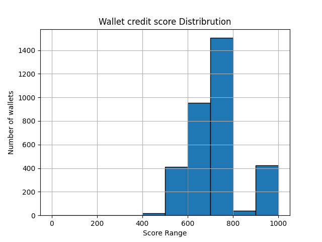
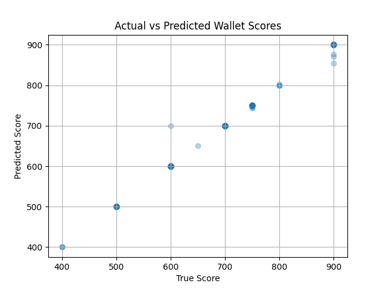

# Analysis Report: Aave V2 Wallet Credit Scoring

This report explains how scores were assigned, visualizes the results, and evaluates the ML model’s performance.

---

## Dataset Overview

- Source: Aave V2 protocol transactions on Polygon
- Format: JSON logs containing `userWallet`, `action`, `amount`, `assetPriceUSD`
- Total wallets processed: Based on the input JSON size
- Actions covered:
  - `deposit`, `borrow`, `repay`, `redeem`, `liquidationcall`

---

## Scoring Logic

| Feature           | Rule                             |
| ----------------- | -------------------------------- |
| **Start score**   | 600 points (neutral baseline)    |
| **Full repay**    | +200 points (repay ≥ borrow)     |
| **Partial repay** | +50 points (repay ≥ 50%)         |
| **No repay**      | –100 points                      |
| **High deposits** | +100 points (if deposit ≥ $1000) |
| **Liquidations**  | –200 per event                   |
| **Final score**   | Clipped between 0–1000           |

---

## Score Distribution

- Most wallets score between **600–800**
- High scores (900+) indicate full repayments, zero liquidations, and healthy deposits
- Low scores (<500) are due to missed repayments and liquidations

---

## ML Model Performance

Model: `RandomForestRegressor`

| Metric      | Value |
| ----------- | ----- |
| MAE (Error) | 0.32  |
| R² Score    | 1.00  |

### Prediction Accuracy

- Strong correlation between predicted and true scores
- Most predictions fall near the diagonal line — shows the model generalizes well

---

## Conclusions

- Simple rules captured key risk behaviors in DeFi borrowing/lending
- ML model generalized rule-based logic effectively
- Future improvements:
  - Add **time-based features** (recency, frequency)
  - Introduce **wallet clustering** (risk bands)
  - Deploy in a DeFi front-end dashboard using Streamlit
